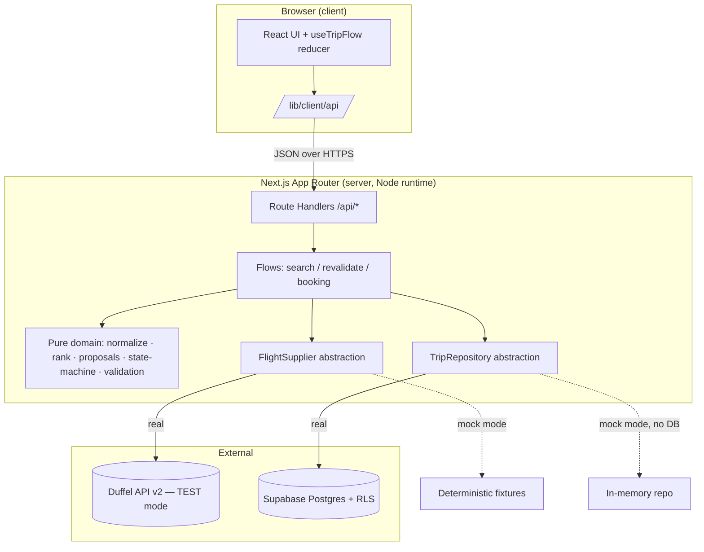
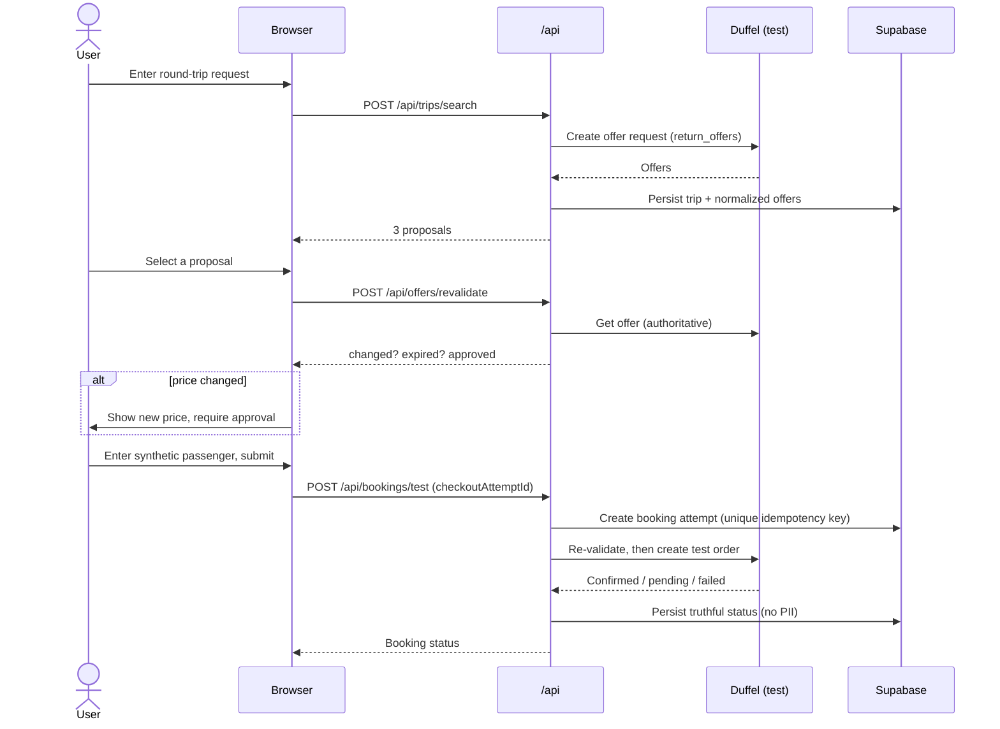

# Trip Autopilot

**One trip. One approval. Zero planning stress.**

Trip Autopilot is an AI-travel-booking MVP. This repository contains the first
**flight-booking vertical slice**: a polished, mobile-responsive web app that
searches **real Duffel sandbox inventory**, intelligently proposes three
flights, revalidates the selected fare, requires explicit approval of any price
change, collects one synthetic passenger, and creates an **idempotent Duffel
test order** — never a real booking or payment.

> Developer test mode only. No real payment or travel booking. No real card or
> passport data is ever collected.

---

## What it does

- Round-trip flight search (one adult) against Duffel API v2 **test mode**.
- Deterministic normalization, ranking, and **three distinct proposals**
  (Best overall / Lowest price / Shortest journey, with a Strong alternative
  fallback).
- Prominent **operating-carrier** display and offer-expiry display.
- Supplier **revalidation** before checkout with explicit **price-change
  approval**.
- Synthetic passenger form (validated, **never persisted or logged**).
- **Idempotent** sandbox order creation that is safe under repeated clicks and
  concurrent submissions.
- Truthful final states: `CONFIRMED`, `PENDING_SUPPLIER`, `PRICE_CHANGED`,
  `EXPIRED`, `FAILED`.
- Browser-refresh recovery via safe status endpoints (never auto-rebooks).
- Persistent audit trail; structured API errors; Row-Level-Security database.
- **Deterministic mock mode** so the whole app and the test suite run with zero
  external credentials.

## What it deliberately does **not** do (today)

Hotels, activities, restaurants, ground transport, maps, native apps, real card
payments / Stripe, production airline bookings, passport storage, user accounts,
social login, subscriptions, LLM itineraries, price monitoring, auto-rebooking,
group/multi-passenger/multi-city travel, currency conversion, email/push,
admin dashboard. Clean extension points are left for these, but they are out of
scope for this slice.

---

## Architecture



## Booking sequence



See [`docs/architecture.md`](docs/architecture.md) and
[`docs/state-machine.md`](docs/state-machine.md) for details.

---

## Prerequisites

- Node.js 20+ (tested on Node 22)
- npm (the repo ships a `package-lock.json`)
- For real sandbox mode: a **Duffel test** account and a Supabase project

## Installation

```bash
npm install
cp .env.example .env.local   # fill in values (see below)
```

## Run in mock mode (zero credentials)

```bash
# .env.local
TRAVEL_APP_MOCK_MODE=true
NEXT_PUBLIC_TRAVEL_APP_MOCK_MODE=true
```

```bash
npm run dev      # http://localhost:3000
```

In mock mode the app uses deterministic local fixtures for the supplier and an
in-memory repository when no database is configured. The UI shows a
**“Local mock inventory”** badge. Data resets when the server restarts.

## Run in real Duffel sandbox mode

1. Create a Supabase project and apply the migration (below).
2. Create a **Duffel test** access token (`duffel_test_…`).
3. Set the environment variables (below) and **leave mock mode off**.

```bash
npm run build && npm start
```

The app refuses to start supplier operations unless the token clearly belongs to
Duffel **test** mode.

---

## Environment variables

| Name | Required | Exposed to browser | Purpose |
|---|---|---|---|
| `DUFFEL_ACCESS_TOKEN` | real mode | **No** | Duffel **test** token (`duffel_test_…`). |
| `NEXT_PUBLIC_SUPABASE_URL` | real mode | Yes (URL only) | Supabase project URL. |
| `SUPABASE_SECRET_KEY` | real mode | **No** | Supabase server secret key (preferred). |
| `SUPABASE_SERVICE_ROLE_KEY` | legacy | **No** | Legacy service-role key (fallback). |
| `TRAVEL_APP_MOCK_MODE` | optional | No | `true` enables server mock mode. |
| `NEXT_PUBLIC_TRAVEL_APP_MOCK_MODE` | optional | Yes | UI hint for the mock badge only. |
| `DUFFEL_WEBHOOK_SECRET` | optional | No | Reserved for future webhooks. |
| `LOG_LEVEL` | optional | No | `error`/`warn`/`info`/`debug`. |

Privileged keys must **never** be placed in `NEXT_PUBLIC_*` variables. Only the
Supabase **URL** is public.

## Supabase migration

Apply [`supabase/migrations/001_initial_schema.sql`](supabase/migrations/001_initial_schema.sql):

**Option A — Supabase SQL editor:** paste the file contents and run it.

**Option B — Supabase CLI:**

```bash
supabase db push        # if using the Supabase CLI with this repo linked
# or
psql "$SUPABASE_DB_URL" -f supabase/migrations/001_initial_schema.sql
```

The migration creates `trip_requests`, `flight_offers`, `booking_attempts`,
`audit_events`, enables RLS on all four (with **no** public policies — the
server secret key is the only access path), adds indexes, an `updated_at`
trigger, and all required constraints.

## Duffel test-mode setup

1. Sign up at <https://app.duffel.com> and switch to **Test mode**.
2. Developers → Access tokens → create a **Test** token (`duffel_test_…`).
3. Put it in `DUFFEL_ACCESS_TOKEN`. For deterministic searches, use the Duffel
   **Airways** test inventory and Duffel's published error-scenario routes.
   Verify current routes in the Duffel docs before relying on a specific one.

---

## Running checks

```bash
npm run typecheck   # tsc --noEmit (strict)
npm run lint        # next lint / eslint
npm run test        # vitest (watch)
npm run test:run    # vitest run (CI)
npm run build       # production build
npm run check       # typecheck + lint + test:run + build
```

## Manual test procedure

See [`docs/manual-testing.md`](docs/manual-testing.md). Quick happy path
(mock mode): search `LHR → JFK`, pick a proposal, approve, enter synthetic
passenger details, submit — observe a confirmed sandbox reservation, then click
submit again and confirm the same booking attempt is returned (no duplicate).

## Vercel deployment

See [`docs/deployment.md`](docs/deployment.md). Summary: import the repo, set the
environment variables in Project Settings (use a **test** Duffel token only),
redeploy after any env change, and verify `/api/health`.

---

## Security & privacy notes

- All secrets are server-side; none are bundled to the browser.
- Passenger details are validated, forwarded to the supplier, and **never
  persisted or logged**. A redaction utility scrubs sensitive keys from logs.
- No card or passport fields exist anywhere in this MVP.
- Raw supplier payloads are stored server-side only and never returned to the
  browser.
- RLS is enabled with no anonymous policies; the server secret key is the only
  database path.
- Mock mode is server-controlled; the browser cannot enable it.

## Known limitations

- One adult, round-trip only; no seat maps, baggage, or services.
- In mock mode without a database, persistence is in-memory and ephemeral.
- Pending orders are reconciled on-demand via the status endpoint (no webhooks).
- Trip-status recovery restores proposals; booking recovery uses the booking id
  stored in `sessionStorage`.

## Production-readiness gaps

User accounts + per-user RLS policies, webhook-driven order reconciliation,
rate limiting, payment handling, retry/backoff around supplier calls at the
edge, observability/metrics, and multi-passenger support.

## Next implementation priority

**Webhook-driven order reconciliation** for `PENDING_SUPPLIER` orders, so a
pending Duffel order is promoted to `CONFIRMED` automatically rather than only on
a manual status refresh.
