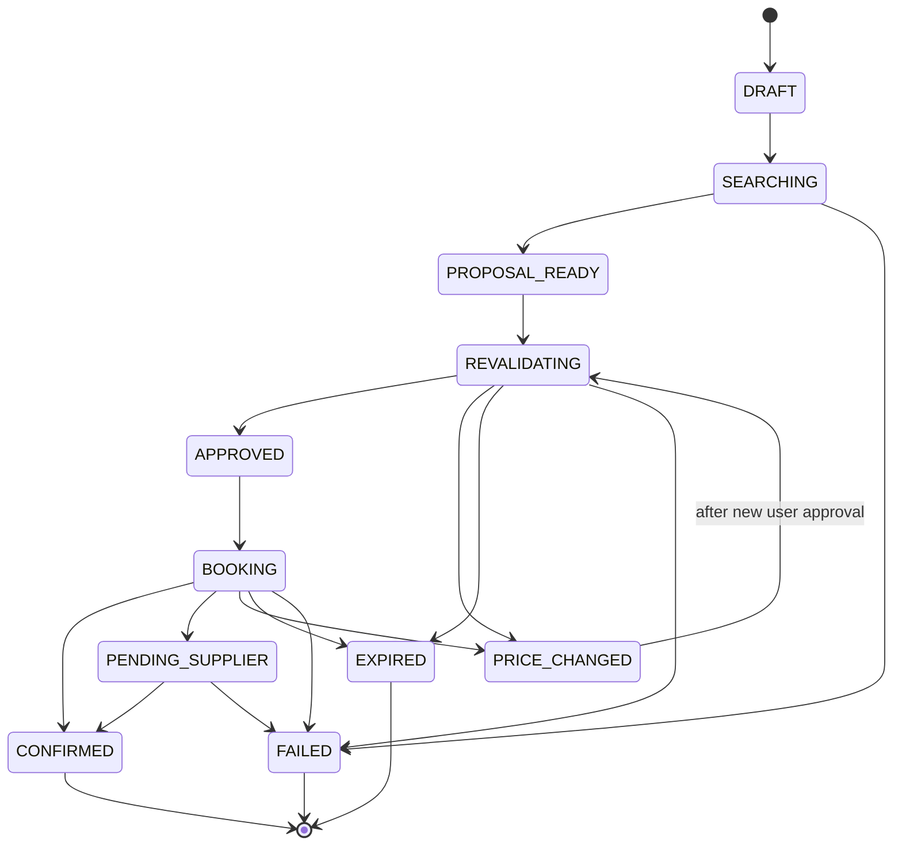
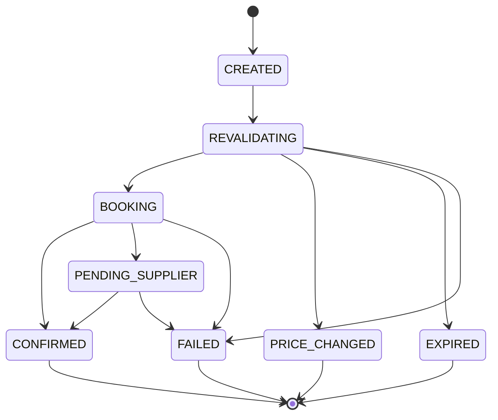
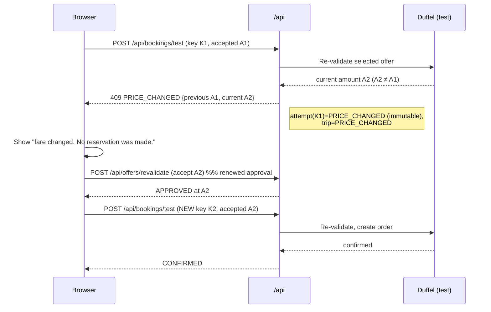
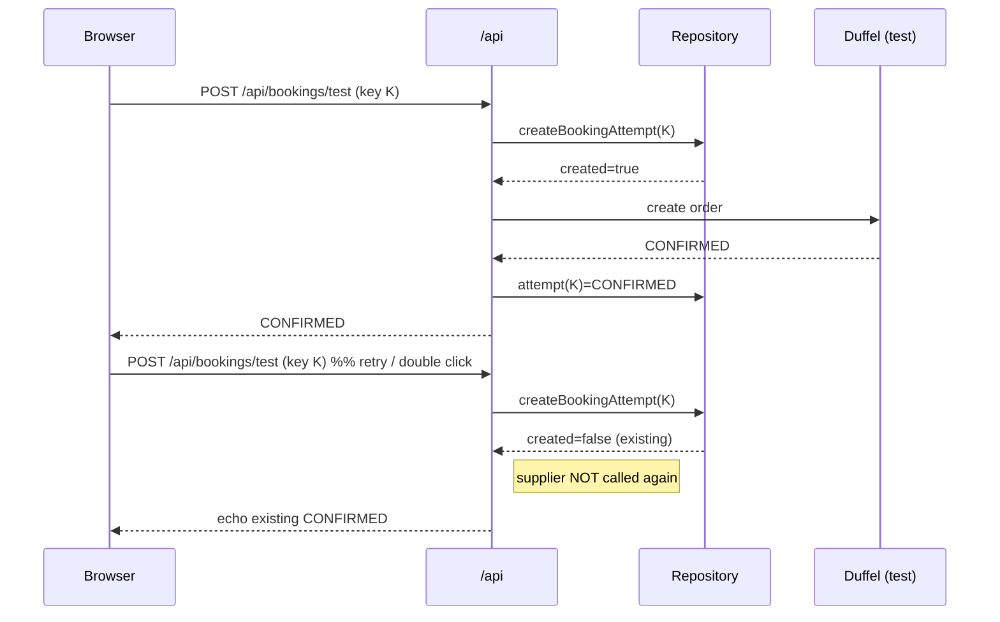

# State machines

All transitions are validated by deterministic code in
`src/lib/booking/state-machine.ts`. Illegal transitions throw and are surfaced as
controlled errors.

## Trip state

## Booking-attempt state

## Price-change approval loop

A booking is never created when the supplier amount/currency differs from what
the user approved. The original attempt is left immutable as an audit record; a
genuinely new commercial decision uses a **new** `checkoutAttemptId`.

## Idempotent retry behaviour

The browser generates one `checkoutAttemptId` per approved decision and reuses
it across network retries of unknown outcome. The server keys the attempt on this
UUID (unique DB constraint). A duplicate request never calls the supplier again.

Concurrent duplicates resolve to a single supplier call: one insert wins, the
other catches the unique violation and returns the existing attempt.
